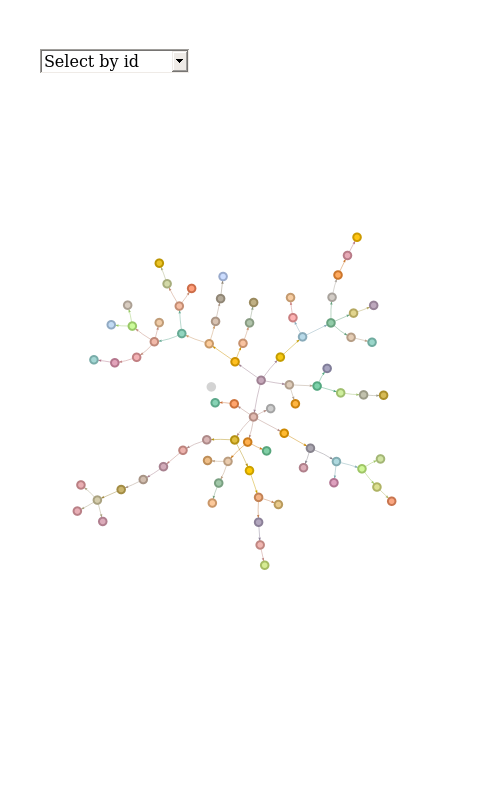
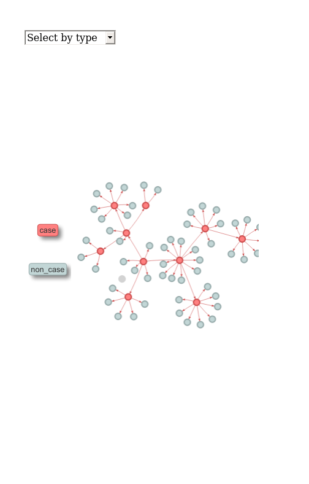

[](https://cran.r-project.org/package=simulacr)

# Welcome to the *simulacr* package!

This package is under development. Do not use it without contacting the authors first.

## Installing the package

To install the current stable, CRAN version of the package, type:

```r
install.packages("simulacr")
```

To benefit from the latest features and bug fixes, install the development, *github* version of the package using:

```r
devtools::install_github("reconhub/simulacr")
```

Note that this requires the package *devtools* installed.


# What does it do?

*simulacr* implements outbreak simulation using branching processes. The main
features of the package include:

* `simulate_outbreak`: the main function, allowing to simulate outbreaks for
  specified values of reproduction number, incubation period, duration of
  infectiousness, and optionally reporting delays; it outputs a linelist stored
  as a `data.frame` with the class `outbreak`, including information on
  transmission chains; the output can be converted to `epicontacts` objects for
  visualisation, and plotted using `plot(...)`
  
* `as_epicontacts`: a function to convert `outbreak` object to `epicontact`;
  called implicitely when plotting `outbreak` objects
  
* `make_disc_gamma`: wrapper function to build discretised Gamma distributions
  easily
  
* `draw_labels`: wrapper function to generate random alphanumeric labels

<br>


# Worked example

This brief example illustrates how we can simulate an outbreak, with different
ways of specifying input distributions.

## Specifying delay distributions

Distributions can be specified in different ways:

* as a discretised distribution stored as `distcrete` object, e.g. generated via
  `make_disc_gamma`
* as a function with a single argument (the delay) computing probability mass
  function (pmf) of different delays
* as a vector of $n$ positive numbers, taken to be the pmf of delays of
  0:($n$-1)
  
We illustrate these different options below, with:

* a flat distribution of the incubation time 1-4 days (all other values have a
null probability)
* an infectious period defined as a discretised Gamma distribution stored as a
  `distcrete` object
* a reporting delay following a Poisson distribution, specified as a function


```r
library("simulacr")

incubation <- c(0, 1, 1, 1, 1) # numbers = unscaled PMF
infectious_period <- make_disc_gamma(10, 7) # distcrete object
reporting <- function(x) dpois(x, 5) # PMF function
```

## Simulating an outbreak


```r
set.seed(1)
x <- simulate_outbreak(R = runif(100, 1, 3), # random values on [1;3]
                       dist_incubation= incubation,
                       dist_infectious_period = infectious_period,
                       dist_reporting = reporting)
```

The output is a `data.frame` with the class `outbreak`, which contains a
linelist of cases:


```r
class(x)
```

```
## [1] "outbreak"   "data.frame"
```

```r
dim(x)
```

```
## [1] 77  6
```

```r
head(x)
```

```
##       id source date_infection date_onset date_report        R
## 1 eLGzdD   <NA>              0          3          12 1.954460
## 2 MQ90i6 eLGzdD              4          5          12 2.209867
## 3 VCEaZ4 MQ90i6              8         11          18 2.284577
## 4 bEGjSA eLGzdD             12         13          17 2.321596
## 5 k6rcYK eLGzdD             12         16          19 1.764776
## 6 msP3Ki bEGjSA             15         16          19 2.514174
```

```r
tail(x)
```

```
##        id source date_infection date_onset date_report        R
## 72 K0450K S0jiBe             83         84          89 2.321596
## 73 7a20Ap xeKC7z             83         86          91 1.403364
## 74 41R9ih uijTrA             85         87          91 1.820168
## 75 oiHVQb Q2diLw             86         87          91 2.284577
## 76 vEGjkv 7a20Ap             86         88          92 2.796779
## 77 uo5Bds shTo1z             90         94          98 1.490977
```

This object can be plotted using (this will open an interactive graph:


```r
plot(x)
```



For any work relying on transmission trees, it may be easiest to convert the
`outbreak` object to an `epicontacts`:


```r
net <- as_epicontacts(x)
net
```

```
## 
## /// Epidemiological Contacts //
## 
##   // class: epicontacts
##   // 77 cases in linelist; 77 contacts;  directed 
## 
##   // linelist
## 
## # A tibble: 77 x 4
##    id     date_infection date_onset date_report
##    <chr>           <dbl>      <int>       <int>
##  1 eLGzdD              0          3          12
##  2 MQ90i6              4          5          12
##  3 VCEaZ4              8         11          18
##  4 bEGjSA             12         13          17
##  5 k6rcYK             12         16          19
##  6 msP3Ki             15         16          19
##  7 Ntdjbt             16         17          21
##  8 iwXiO6             18         20          24
##  9 vHa6qJ             18         19          22
## 10 8Fix6l             19         21          23
## # … with 67 more rows
## 
##   // contacts
## 
## # A tibble: 77 x 2
##    from   to    
##    <chr>  <chr> 
##  1 <NA>   eLGzdD
##  2 eLGzdD MQ90i6
##  3 MQ90i6 VCEaZ4
##  4 eLGzdD bEGjSA
##  5 eLGzdD k6rcYK
##  6 bEGjSA msP3Ki
##  7 bEGjSA Ntdjbt
##  8 bEGjSA iwXiO6
##  9 MQ90i6 vHa6qJ
## 10 VCEaZ4 8Fix6l
## # … with 67 more rows
```


## Simulating contacts

Contacts can be simulated and added to a simulated outbreak, using similar
procedures to the one used in `simulate_outbreak`, with a few differences:

* `n_contacts`: the numbers of contacts per index case is specified in the same
  way as the reproduction number `R` in `simulate_outbreaks`
  
* the two distributions relate to the time between onset of the index case and
  the beginning of secondar exposures (`dist_time_to_contact`) and the duration
  of the exposure window (`duration`) after the first day of contact


```r
## exposure starts 0-2 days post onset
time_to_contact = c(1, 1, 1)

## geom dist for duration of exposure
duration <- function(x) dgeom(x, prob = .9)

x_with_contacts <- simulate_contacts(
    x[1:10, ],
    n_contacts = 1:10, # 1 to 10 contacts
    dist_time_to_contact = time_to_contact,
    dist_duration = duration)

## check output
class(x_with_contacts)
```

```
## [1] "outbreak"   "data.frame"
```

```r
dim(x_with_contacts)
```

```
## [1] 64  9
```

```r
head(x_with_contacts)
```

```
##        id source date_infection date_onset date_report        R     type
## 1  eLGzdD   <NA>              0          3          12 1.954460     case
## 2  MQ90i6 eLGzdD              4          5          12 2.209867     case
## 12 x72VZq eLGzdD             NA         NA          NA       NA non_case
## 14 tsI8G0 eLGzdD             NA         NA          NA       NA non_case
## 11 HBGWgN eLGzdD             NA         NA          NA       NA non_case
## 13 ewV5zO eLGzdD             NA         NA          NA       NA non_case
##    date_exposure_start date_exposure_end
## 1                    0                 0
## 2                    4                 4
## 12                   4                 4
## 14                   4                 4
## 11                   5                 5
## 13                   5                 5
```

```r
plot(x_with_contacts)
```




# Resources

## Vignettes

No vignette currently available.


## Getting help online

Bug reports and feature requests should be posted on *github* using the [*issue*](http://github.com/reconhub/simulacr/issues) system. All other questions should be posted on the **RECON forum**: <br>
[http://www.repidemicsconsortium.org/forum/](http://www.repidemicsconsortium.org/forum/)

Contributions are welcome via **pull requests**.

Please note that this project is released with a [Contributor Code of Conduct](CONDUCT.md). By participating in this project you agree to abide by its terms.

